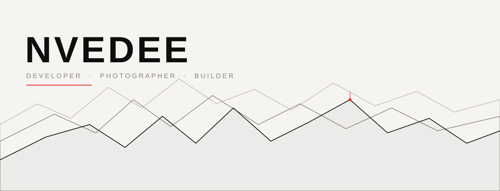
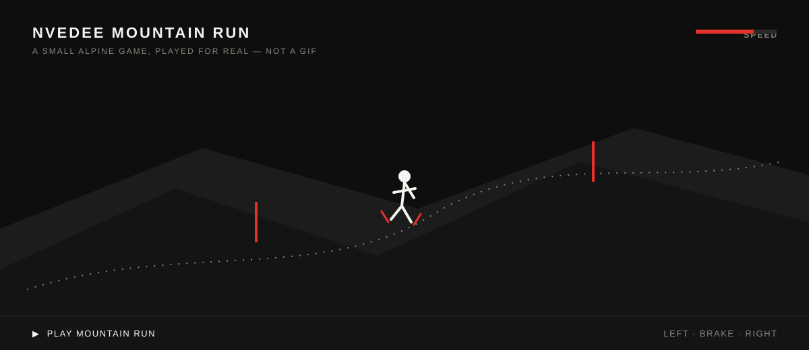
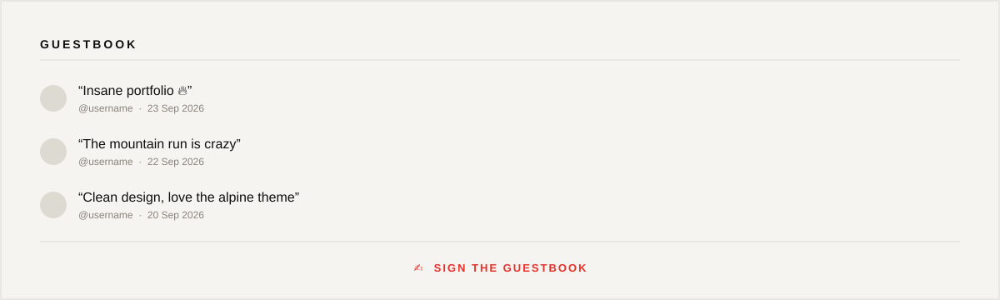

<div align="center">



<sub>Zürich · Winterthur, Switzerland 🇨🇭</sub>

</div>

<!--
  hey, you're reading the source. that's already step one.
  the mountain has a summit few visitors ever reach — try the Konami code
  on the Mountain Run page once it's live: ↑ ↑ ↓ ↓ ← → ← → B A
-->

<br>

I build things and I shoot things — mostly at speed, usually outdoors. By day: full‑stack developer. By weekend: photographing hill‑climb racing, ice hockey and alpine events across Switzerland.

<br>

<div align="center">

[ **WORK** ](https://nveedee.ch/work) · [ **PHOTOGRAPHY** ](https://nveedee.ch/sport) · [ **CONTACT** ](https://nveedee.ch/contact)

</div>

<br><br>

## 🏔️ NVEDEE Mountain Run

<a href="https://nveedee.ch/mountain-run">
  
</a>

A tiny alpine descent, playable in your browser — steer, brake, dodge gates, post a run. Not a gif, not a screenshot.

<!-- the run has a second, unmarked route. it doesn't show up on the piste line. -->

<div align="center">

[ **▶ PLAY MOUNTAIN RUN** ](https://nveedee.ch/mountain-run) &nbsp;·&nbsp; [ **🏆 VIEW LEADERBOARD** ](https://nveedee.ch/mountain-run#leaderboard)

</div>

<br><br>

## 💬 Guestbook

<a href="https://nveedee.ch/guestbook">
  
</a>

Sign in with GitHub, leave a line. No clone, no PR, no code — just a message with your name on it.

<div align="center">

[ **✍️ SIGN THE GUESTBOOK** ](https://nveedee.ch/guestbook)

</div>

<br><br>

## Featured Projects

<table>
<tr>
<td width="50%" valign="top">

**🏒 [NL Tracker](https://github.com/nveedee/nl-tracker)**
Live Swiss National League analytics — ELO ratings, Monte‑Carlo season simulation, playoff probabilities, power rankings and match predictions.

</td>
<td width="50%" valign="top">

**🏔️ [Bergrennen Oberhallau 2026](https://nveedee.ch/work/bergrennen-oberhallau-2026)**
Photography & videography from a Swiss hill‑climb race — speed, focus and the raw energy of racing up a mountain.

</td>
</tr>
<tr>
<td width="50%" valign="top">

**🏁 [Arosa ClassicCar 2026](https://nveedee.ch/arosa-classiccar)**
The 22nd edition of the international hill‑climb for historic sports and racing cars, through Langwies to Arosa.

</td>
<td width="50%" valign="top">

**🌐 [nveedee.ch](https://nveedee.ch)**
This portfolio itself — Next.js, TypeScript, next‑intl (de/en), self‑hosted fonts, zero unnecessary dependencies.

</td>
</tr>
</table>

<br>

## Photography

<div align="center">

🏒 Ice Hockey &nbsp;·&nbsp; 🏎️ Motorsport &nbsp;·&nbsp; 🏔️ Alpine &nbsp;·&nbsp; 🎉 Events

**[ VIEW THE FULL GALLERY → ](https://nveedee.ch/sport)**

</div>

<br>

## Tech Stack

<div align="center">

`TypeScript` `Next.js` `React` `Tailwind CSS` `Framer Motion` `next-intl` `Vercel`

</div>

<br>

## GitHub Stats

<div align="center">


</div>

<br>

## Contact

<div align="center">

[ **Instagram** ](https://instagram.com/nveedee.visuals) &nbsp;·&nbsp; [ **TikTok** ](https://tiktok.com/@nveedee.visuals) &nbsp;·&nbsp; [ **YouTube** ](https://youtube.com/@nveedee.visuals) &nbsp;·&nbsp; [ **contact@nveedee.ch** ](mailto:contact@nveedee.ch)

<sub>

<details>
<summary>·</summary>
<br>

```
        /\
       /  \
      /    \    you made it to the summit.
     /  /\  \
    /  /  \  \
   /__/____\__\
```

Most people scroll past. You didn't. That's the kind of attention to detail I look for in collaborators — say hi: **contact@nveedee.ch**

</details>

</sub>

<sub>Made in Switzerland · [nveedee.ch](https://nveedee.ch)</sub>

</div>
